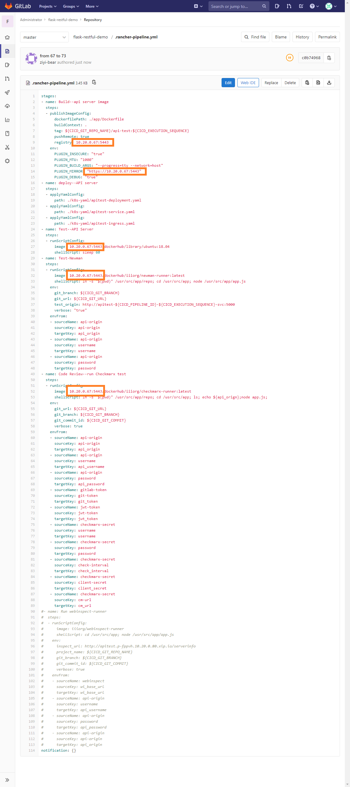
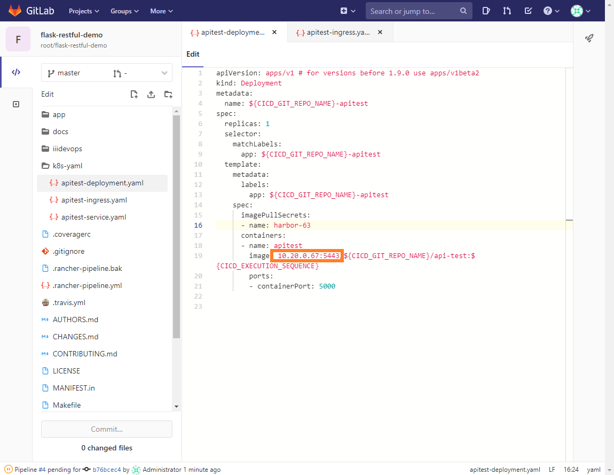

## pipeline修改部分

* 修改數量可能隨yaml數量不同而有所有影響
* (此功能已禁止使用，因此下面說明不包含此步驟)對外網域名稱設定和對外IP是由k8s上有部屬ingress的Node IP來決定，可採用任一Node IP即可

以下僅需更改為Harbor IP+PORT 即可
* 檔案位置: `.rancher-pipeline.yaml`  
)

* 檔案位置: `k8s-yaml/api-test-deployment.yaml`

